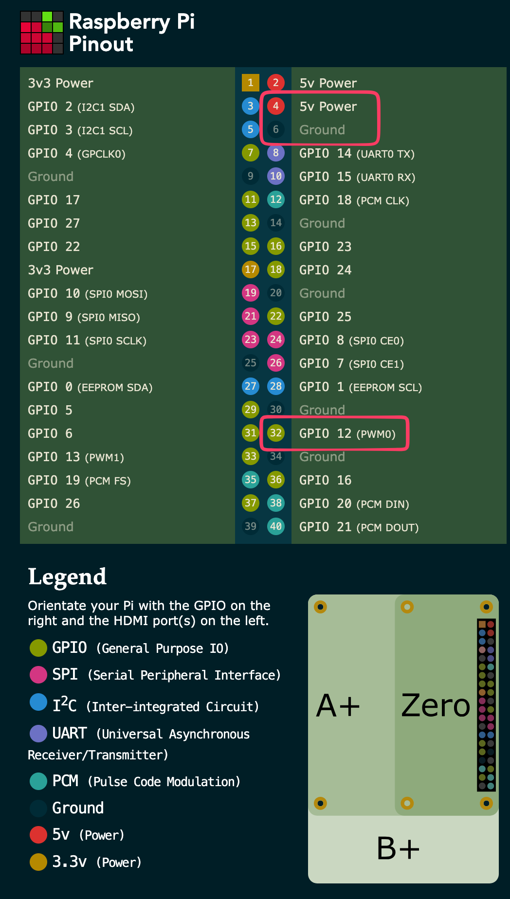

## MPD Pi Bridge

### Setup

Clone the repo onto the Pi, then run:

```bash
make setup
```

This installs system packages, creates the virtualenv, installs dependencies, registers and starts the systemd service.

### Service Commands

```bash
make update   # git pull + install deps + restart
make restart  # restart the service
make start    # start the service
make stop     # stop the service
make status   # show service status
make logs     # tail service logs
make ldr      # start the ldr script for tuning photoresistor
```

## Usage

Access the API via the pi's hostname, for example raspberrypi.local.

View the available routes at http://{hostname}.local:8000/docs

Send a post to the available endpoints. For example, to play the queue:

```bash
curl -X POST http://{hostname}.local:8000/play
```

### Restarting Mopidy

The `POST /service/mopidy/restart` endpoint restarts the mopidy service. Because this requires sudo, the `pi` user must be granted passwordless sudo for that specific command.

Run `sudo visudo` on the Pi and add this line at the end of the file:

```
pi ALL=(ALL) NOPASSWD: /bin/systemctl restart mopidy
```

Without this, the endpoint returns a `401` error.

## Configuration

All device-local configuration lives in `piserver.json` in the repo root. This file is gitignored and never committed — each device has its own copy. Use `piserver.example.json` as a starting point:

```bash
cp piserver.example.json piserver.json
```

The full schema:

```json
{
  "use_sensor": false,
  "quickplay": [
    { "artist": "Artist Name", "album": "Album Name" },
    { "artist": "Another Artist" }
  ],
  "ir": {
    "power": {
      "sirc": { "address": "0x10", "command": "0x2E" },
      "repeat": 3,
      "switch_delay_s": 3.0
    },
    "input": {
      "sirc": { "address": "0x10", "command": "0x12" },
      "repeat": 3,
      "switch_delay_s": 0.5
    }
  }
}
```

All sections are optional. If `piserver.json` is absent or a section is missing, that feature is silently disabled and playback continues normally.

- **`use_sensor`** — set to `true` to enable the photoresistor power sensor (see below). When enabled, the server checks whether the stereo is on before sending the `input` command, and powers it on first if needed. Defaults to `false`.
- **`quickplay`** — list of artist/album targets for the `/quickplay/{index}` endpoints. Each entry has `artist`, optionally `album`, and optionally `shuffle: true` for shuffle-all.
- **`ir`** — IR command codes for the stereo. Keys map to Sony SIRC commands. See the IR Blaster section below for field details.

## IR Blaster (Sony Stereo Input Control)

When a play command is received the server sends an IR signal to switch the Sony stereo to the correct input before starting playback.

### IR LED Transmitter

#### Parts

- Adafruit Super-bright 5mm IR LED (ADA388, 940 nm) [chain two together for better signal]
- 2N2222A NPN transistor
- 33 Ω resistor (LED current limiter)
- 1 kΩ resistor (transistor base)
- 100 nF ceramic capacitor (decoupling, optional but recommended)

**Why GPIO 12?** The Waveshare audio HAT uses I2S, which occupies GPIO 18 (BCLK) — the usual hardware PWM0 pin. GPIO 12 is the alternate hardware PWM0 mapping and is free.

#### Wiring

```
5V  (Pin  2) ──[33Ω]──[ADA388 anode→cathode]──┐
                                               Collector
                                            [2N2222A NPN]
                                               Base ──[1kΩ]── GPIO 12 (Pin 32)
                                               Emitter
GND (Pin 34) ──────────────────────────────────┘
```

Anode is the longer lead of the LED. Point the LED directly at the stereo's IR receiver window — the ADA388 has a narrow 20° beam, so aim matters.

With the flat part of the transistor facing you, the pinout is EBC (eat big cookie).

#### Pi Pinout



#### System Configuration

**1. Enable the kernel IR transmitter overlay.**

On Pi OS Bookworm:

```bash
sudo nano /boot/firmware/config.txt
```

On Bullseye or earlier:

```bash
sudo nano /boot/config.txt
```

Add at the end of the file:

```ini
dtoverlay=gpio-ir-tx,gpio_pin=12
```

Reboot:

```bash
sudo reboot
```

After rebooting, `/dev/lirc0` should appear.

**2. Grant the `pi` user access to the LIRC device.**

```bash
echo 'SUBSYSTEM=="lirc", MODE="0660", GROUP="pi"' | sudo tee /etc/udev/rules.d/99-lirc.rules
sudo udevadm control --reload-rules && sudo udevadm trigger
```

**3. Install `ir-keytable`** (included in `make setup`, or install manually):

```bash
sudo apt install -y ir-keytable
```

### Discovering Your Sony SIRC Command

You need the **address** and **command** values for each button on your Sony stereo.

- **A / address** — identifies the device type (e.g. amplifier, TV). Only the device with a matching address responds.
- **C / command** — the action to perform (input select, volume up, etc.).

Use a Flipper Zero: point your Sony remote at it and capture the button press. It will report something like `SIRC A: 0x10 C: 0x12`.

### IR Command Configuration

IR commands live under the `"ir"` key in `piserver.json`. Address and command values can be hex strings (`"0x10"`) or decimal integers (`16`).

Per-command fields:

- **`sirc`** — object with `address` and `command`. The SIRC variant is selected automatically based on address width: addresses up to `0x1F` use SIRC-12 (5-bit address); addresses up to `0xFF` use SIRC-15 (8-bit address).
- **`repeat`** — number of times to send the frame. Sony SIRC requires `3`. Defaults to `1`.
- **`switch_delay_s`** — seconds to wait after sending. Useful for `input` to give the stereo time to switch, or for `power` to wait for the stereo to finish booting. Omit or set to `0` for no delay.

The `input` key is what the server sends before starting playback. The `power` key is sent first when the sensor detects the stereo is off (see below).

### Testing

With `piserver.json` configured, trigger the command through the API:

```bash
curl -X POST http://{hostname}.local:8000/play
```

The server logs will show `ir_blaster: sent sony12 A:0x10 C:0x12 x3`. If you have a Flipper Zero, point it at the LED while triggering to verify the transmitted address and command match what your remote sends.

### Photoresistor Power Sensor (optional — auto power-on)

When `use_sensor: true` is set in `piserver.json`, the server reads a photoresistor wired to GPIO 17 before sending the input-select command. When the stereo is off (no LED light detected), it first sends the `"power"` IR command and waits for the stereo to boot, then sends `"input"`.

#### Parts

- LDR (photoresistor, any common 5mm type)
- 10 kΩ resistor (or a potentiometer for initial tuning — see below)

**Why GPIO 17?** GPIO 18–21 are claimed by the Waveshare audio HAT (I2S), GPIO 12 is IR TX, GPIO 24 is IR RX, and GPIO 2/3 are I2C. GPIO 17 is free.

#### Wiring

Point the LDR at the power LED on the stereo.

```
3.3V (Pin  1) ──[LDR]──┬── GPIO 17 (Pin 11)
                      [10kΩ]
                        │
               GND (Pin  9) ──┘
```

- **Stereo on (LED lit):** LDR resistance drops → voltage at GPIO rises → reads HIGH
- **Stereo off (dark):** LDR resistance rises → 10 kΩ pulls low → reads LOW

#### Tuning the resistor

The 10 kΩ value is a starting point. Depending on how bright the stereo's LED is and how closely you can aim the LDR, you may need to adjust it. Use a potentiometer in place of the fixed resistor while tuning, then replace it with the nearest fixed resistor value once the reading is stable.

To monitor the sensor reading in real time while adjusting:

```bash
python3 scripts/sense_stereo.py
```

This prints `ON` or `OFF` (with a timestamp) each time the reading changes. Aim for the GPIO voltage to be clearly above ~2 V when the LED is lit and clearly below ~1.3 V when dark.

### IR Receiver (optional — for discovering command codes)

A TSOP38238 wired to the Pi lets you decode your existing Sony remote. This is only needed if you don't have a Flipper Zero and want to read codes directly on the Pi.

#### Parts

- TSOP38238, VS1838B, or any 38 kHz demodulating IR receiver (3 pins: Out, GND, Vs)

#### Wiring

TSOP38238 pinout: flat side facing you, leads pointing down — Out / GND / Vs left to right.

```
5V   (Pin  2) ─────────────────── Vs  (pin 3)
                               [TSOP38238]
GND  (Pin 34) ─────────────────── GND (pin 2)
GPIO 24 (Pin 16) ──────────────── Out (pin 1)
```

#### System Configuration

Add the receiver overlay alongside the transmitter line in `config.txt`:

```ini
dtoverlay=gpio-ir-tx,gpio_pin=12
dtoverlay=gpio-ir,gpio_pin=24
```

Reboot. After rebooting, `/dev/lirc1` should appear alongside `/dev/lirc0`.

### Quick Play

The `quickplay` section of `piserver.json` defines a numbered list of artist/album targets for the `/quickplay/{index}` endpoints. Each entry supports:

```json
{"artist": "Artist Name", "album": "Album Name"}  // play a specific album
{"artist": "Artist Name"}                          // play all albums by artist
{"shuffle": true}                                  // shuffle everything
```

The list can also be managed via the API:

- `GET /quickplay` — return the full list
- `PUT /quickplay` — replace the full list
- `PUT /quickplay/{index}` — update or append a single entry
- `POST /quickplay/{index}` — trigger playback for that entry
